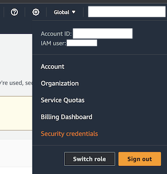
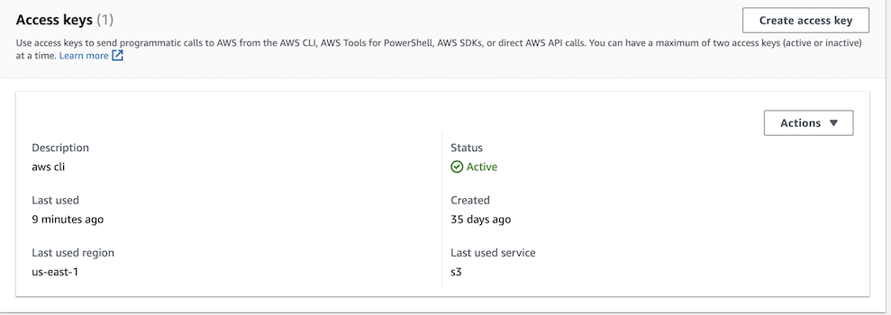
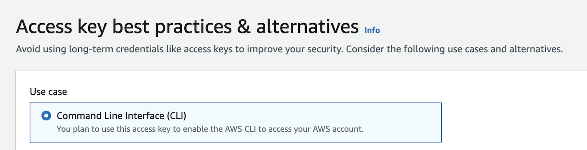
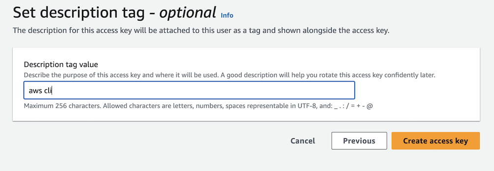
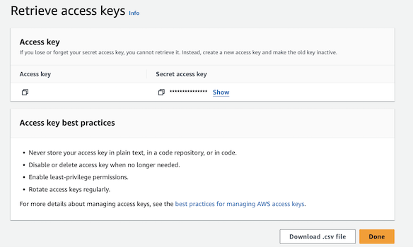

# Learn Generative AI

## What is this?
The learnGenAI repository includes several examples of leveraging generative AI. The code is mainly Python using [Langchain](https://www.langchain.com/) and connecting to [AWS Bedrock](https://aws.amazon.com/bedrock/).


## Getting Started

### Setting up the environment
1. We'll first clone the repository
```bash
git clone https://github.com/vcollak/learnGenAI

```

2. Then we'll create a new virtual environment and activate it

On Windows:
```bash
python -m venv .venv
.venv\Scripts\activate.bat
```

Other OSs:
```bash
python -m venv .venv
source .venv/bin/activate
```

3. Install the right python packages
```bash
pip install -r requirements.txt
```

4. If not already, make sure your Amazon AWS account has been configured

Check that you already have the AWS CLI. If not [download and install it](https://docs.aws.amazon.com/cli/latest/userguide/install-cliv2.html)

```bash
aws --version
```

Configure the AWS cli:
```bash
aws configure
```

You will be asked for your key and a secret:
```bash
AWS Access Key ID [None]: YOUR_KEY_HERE
AWS Secret Access Key [None]: YOUR_SECRET_HERE
Default region name [us-east-1]:
Default output format [None]:
```

If you don't know what your KEY and secret are, you can follow below steps:

1. Access the security page:

2. Click on "Create Access Key"

3. Specify CLI option

4. Optionally set a tag

5. Save your key and secret



5. Test access to your AWS account. You should see a list of S3 buckets you have access to or at minimum not get any errors.
```bash
python examples/0_s3_test.py
```

## Calling Bedrock services
To make our first call, simply execute:
```bash
python examples/1_hello_claude.py
```

This will leverage your AWS credentials and call Bedrock. The code uses the Claude model. You should see something like:

```json
{
   "ResponseMetadata":{
      "RequestId":"dfafaasd-8663-4de0-8cca-42dfsfas",
      "HTTPStatusCode":200,
      "HTTPHeaders":{
         "date":"Sun, 26 Nov 2023 01:20:50 GMT",
         "content-type":"application/json",
         "content-length":"703",
         "connection":"keep-alive",
         "x-amzn-requestid":"qerqerw-33-444-sfds-gsfgs",
         "x-amzn-bedrock-invocation-latency":"4444",
         "x-amzn-bedrock-output-token-count":"130",
         "x-amzn-bedrock-input-token-count":"22"
      },
      "RetryAttempts":0
   },
   "contentType":"application/json",
   "body":<botocore.response.StreamingBody object at 0x107192a70>
}
```

The actual body of the response is in the `body` object. Here it is:

```json
{
   "completion":" Here is a 97 word summary of the book 'Zero to One' by Peter Thiel:\n\nThe book argues that true innovation comes from doing something completely new, not just iterating on what already exists. It encourages thinking from first principles and developing unique insights. The book advises founders to focus on creating monopolies by starting small but with a large vision. It suggests finding secrets - problems hidden in plain sight that you can solve in a proprietary way. Overall, the book makes the case that going from zero to one - true innovation - creates enormous value, whereas going from one to n - incrementalism - does not.",
   "stop_reason":"stop_sequence",
   "stop":"\n\nHuman:"
}```


